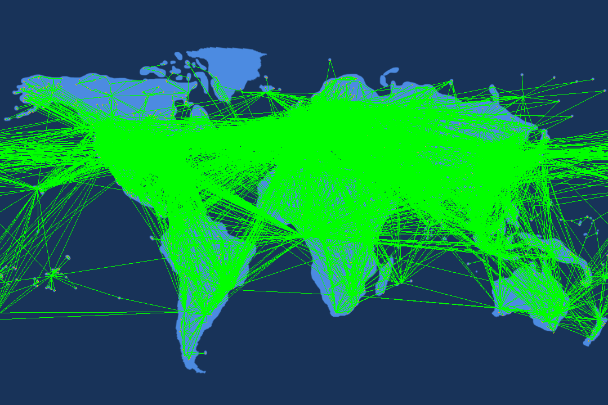

# Results

## List of Successful Implementations 

* Parsed airport and routes data files into a directed 
  * Assigned weights as the real distances between two Airports
* Implemented a Breadth-First Search
* Implemented Dijkstra’s Algorithm to find the shortest path between two airports
* Graphic Output: Map Projection
  * Mapped Airport latitude and longitude to pixel coordinates
  * Visualized Airports on Mercator Map
  * Visualized a Route on Mercator Map
    * Drew lines between connected airports that could wrap around the map to handle flights over the Pacific Ocean
  * Visualized Dijkstra’s Algorithm as a picture and animation of the shortest path
  * Visualized all routes as a picture and animation

In this final project, we managed to accomplish all goals we set in our project proposal. We are really proud to present our projects with all functionalities we have.  

Regarding reading and processing data sets, we have two data files to deal with. One for the airport information and another for keeping records of all the flight routes. The airport info is parsed and stored in a map, easier to lookup by the program when needed. The routes are also parsed and transformed into a directed graph. By looking up the location for each starting and ending point of flight routes, we have a utility class that contains a helper function that can calculate the spherical distance of two airports using the Haversine formula, which is then used as the weight of an edge. This marks the input end of our project.  

Given all the data processed, we run several algorithms to help achieve our goals. The first one is BFS, it helps get all the vertices in the directed graph(the airports) that are connected based on the routes we have and it returns a vector of all such routes. Then, with all the routes and their corresponding distance pre-calculated. We can easily apply Dijkstra’s algorithm to get the shortest path given any two airports as starting and ending points, as long as they are included in the data files we read in the first place. After all such operations, we end up with a vector of all the airports that are passed through in the shortest route, represented using their unique ID defined in the data set.  

For the graphics output, we have several main components to consider. The first one is to mark all the points of airports onto the world map (Mercator map) correctly. We have a corresponding helper function in utility class that transfers the longitude and latitude of the airports into an (x,y) coordinate to the background graph by scaling and shifting. The next part is to draw lines between two airports. We apply similar skills as in mp_stickers to add lines on top of the world map. In the same manner, an animation is created using knowledge in mp_traversals to draw the shortest path generated by Dijkstra’s algorithm one after another onto the world map.  

In all, our project is able to take in inputs of source data files for airports and flight routes, departure airport, destination airport, and output graph and animation names(ending in .png and .gif), and generates the corresponding output graph and animation in “results” folder revealing the shortest path for the provided starting and ending points. Also, all frames for the animation can be found in the “frames” folder. 

## Observations

* The shortest path between two Airports was shown to not be a straight line between the two airports, but rather often involves a connecting flight to a major airport
* When traveling from Champaign Airport (CMI) to Shanghai (PVG), the shortest path will contain O’hare International Airport. Though a direct flight would minimize distance, CMI does not have the plane type to travel such a large distance without any stops.

### Champaign, IL (4049) -> Shanghai, China (3406)

* After visualizing all the routes, we noticed that Europe was almost entirely covered by Routes. There appears to be quite a number of flights from the United States to Asia. The least sparse areas of the map were areas with a small density of airports that are most likely domestic. Areas such as Northern Canada, the bottom of South America, Greenland, and the Angola/Congo region fit this description. 

### All Routes Visualized

### All Routes Animated 

